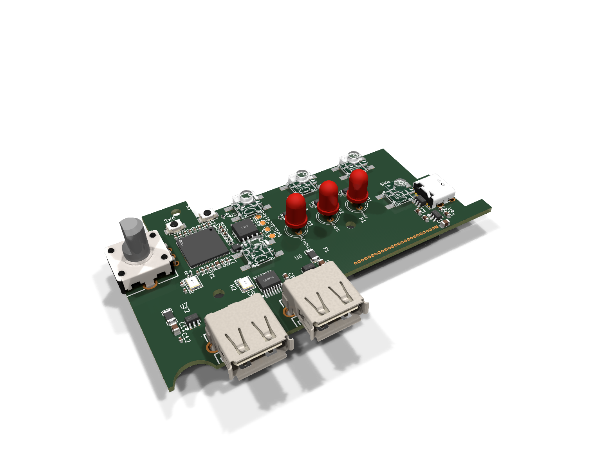
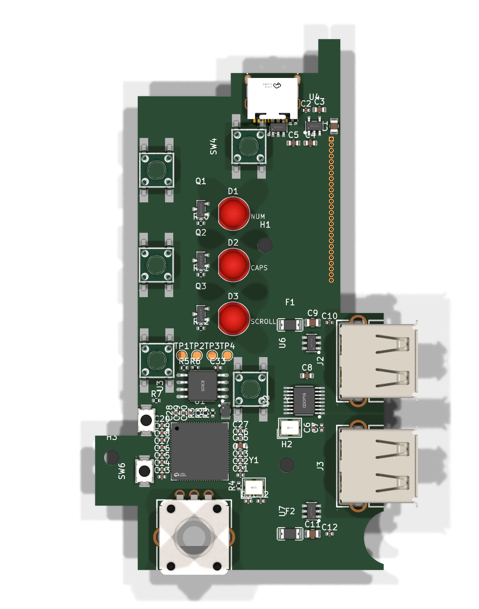
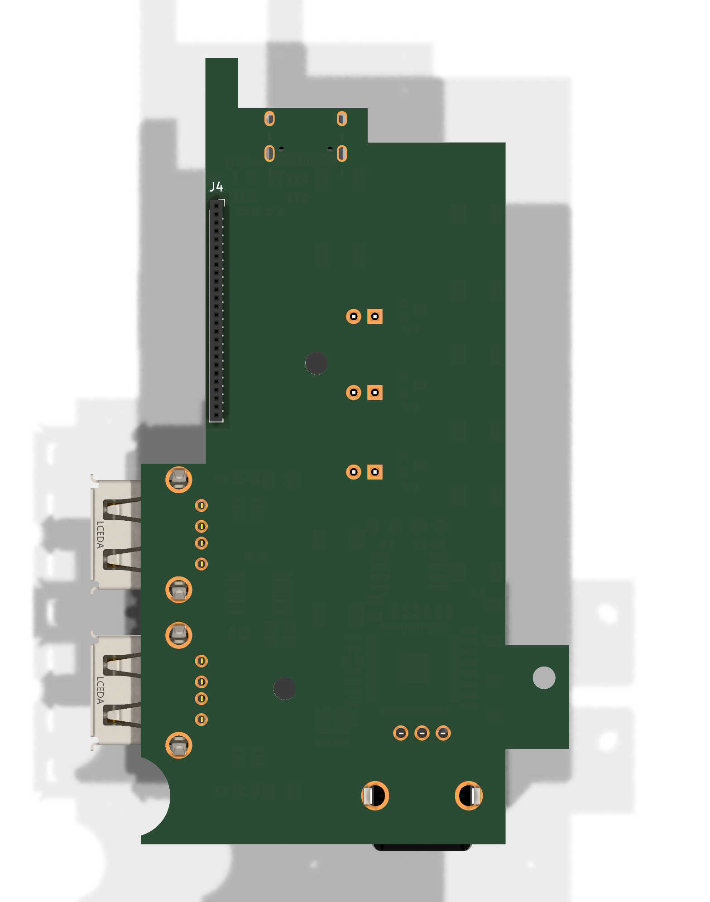

# das4-controller

An open-source replacement controller board for the **Das Keyboard 4 Professional**:
same outline, same holes, same connectors, but with an **RP2350B** you can flash
with QMK, KMK or your own firmware. It keeps the two USB-A ports (as a USB 2.0
hub), the volume knob, the NUM/CAPS/SCROLL LEDs and the five buttons. Every
button gets its own GPIO, so you can make them do whatever you like.

> **Status: circuit done, parts placed, not routed yet.** The outline is measured
> and checked against a 1:1 print. The circuit is written in code and all parts are
> chosen and in stock at JLCPCB. Next: routing. Don't order boards from this yet.



| Top | Bottom |
|---|---|
|  |  |

*The LEDs render red because that's KiCad's generic 5 mm LED model; the real parts are white.*

## Docs

- [Design notes](docs/design.md): architecture, circuit blocks, GPIO map, open questions
- [Bill of materials](docs/bom.md): every part with its LCSC number and live JLCPCB stock
- [Measurements](docs/measurements.md): every dimension, where it came from and how sure we are
- [Fit-check PDF](docs/fit-check-1to1.pdf): print at 100% and lay the original board on it

## Layout

```
hardware/
  circuit/das4.py                          the circuit (SKiDL)
  das4-controller.net                      netlist generated from it
  das4-controller.kicad_pro / .kicad_pcb   KiCad 10 project (board generated from the netlist)
  lib/jlc.*                                JLCPCB part symbols, footprints and 3D models (easyeda2kicad)
  scripts/gen_board.py                     outline, measured positions, placement
  scripts/jlc.py                           search JLCPCB's parts library (no login)
  scripts/bom.py                           docs/bom.md with live stock
docs/                                      notes, renders, fit-check print
```

## Building

The tools come from the KiBot/KiCad container
[`ghcr.io/inti-cmnb/kicad10_auto_full`](https://github.com/INTI-CMNB/kicad_auto),
which is also what CI runs.

```sh
# one-time: create the container
distrobox create --name pcb --image ghcr.io/inti-cmnb/kicad10_auto_full:1.9.1-1_k10.0.5_d13.2_b4.2.4LTS

distrobox enter pcb -- make          # circuit -> netlist -> board, renders, fit-check PDF, DRC
distrobox enter pcb -- make bom      # refresh docs/bom.md with live JLCPCB stock
```

Or use Docker directly:
`docker run --rm -v $PWD:/w -w /w ghcr.io/inti-cmnb/kicad10_auto_full:1.9.1-1_k10.0.5_d13.2_b4.2.4LTS make`.

Open `hardware/das4-controller.kicad_pro` in KiCad 10 to look around.

**Note:** while the mechanical layout is still in flux, the board file is
*generated*. Edit the numbers in `gen_board.py`, not the board file, or your
changes get overwritten on the next `make`. Once the outline is locked down we
switch to editing in KiCad directly.

## License

MIT, see [LICENSE](LICENSE). Not affiliated with Das Keyboard / Metadot.
