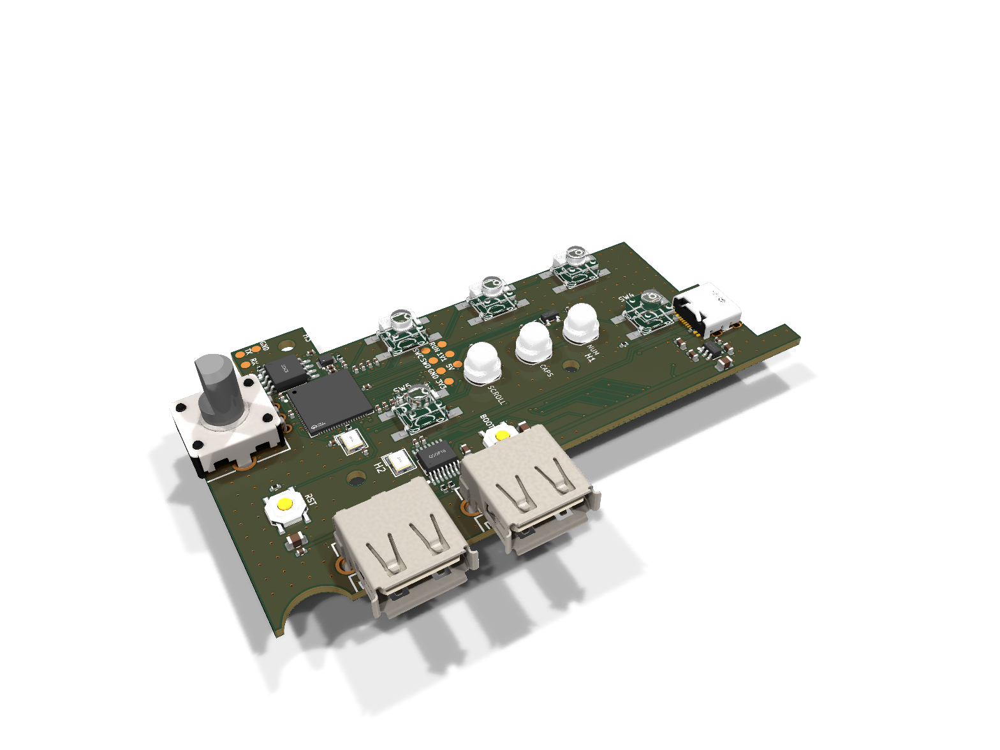
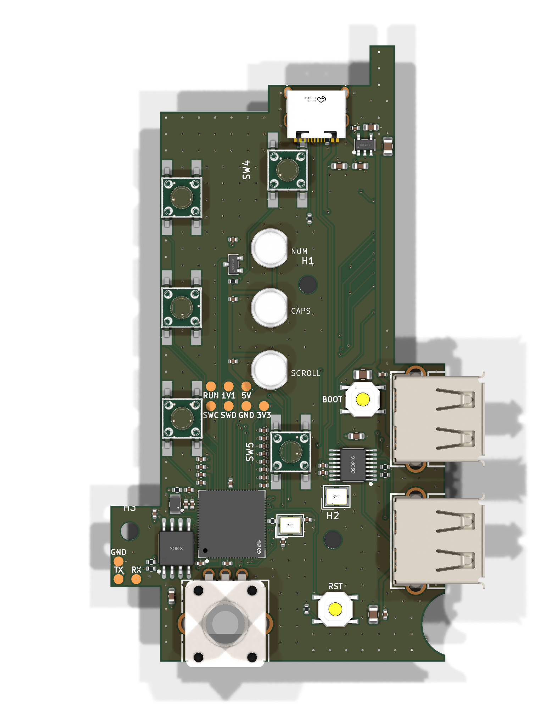
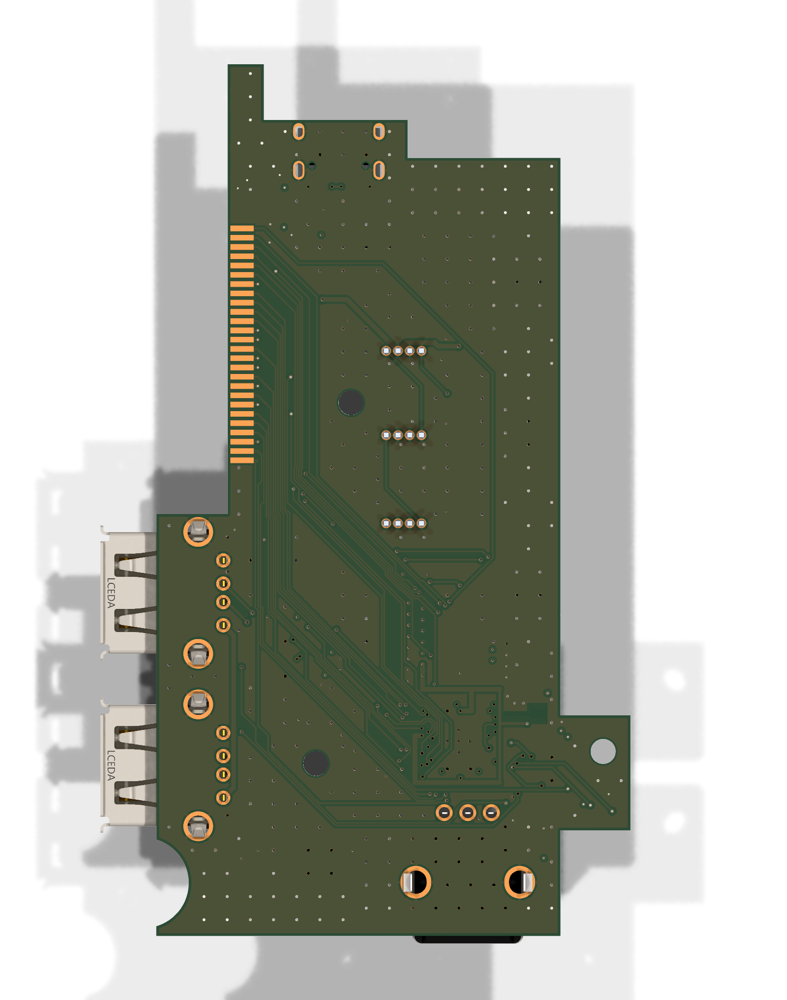

# das4-controller

An open-source replacement controller board for the **Das Keyboard 4 Professional**:
same outline, same holes, same connectors, but with an **RP2350B** you can flash
with your own firmware (pico-sdk today, KMK/CircuitPython, QMK once it supports the RP2350B). It keeps the two USB-A ports (as a USB 2.0
hub), the volume knob, the NUM/CAPS/SCROLL LEDs (now RGB, any colour) and the five buttons. Every
button gets its own GPIO, so you can make them do whatever you like.

> **Status: ready to order after a final 1:1 fit print.** Routed, DRC clean (0 unconnected, 0 real
> violations), with independent circuit and layout reviews, a check against Raspberry Pi's RP2350
> design guide, and a firmware build for this pinout. See [docs/plan.md](docs/plan.md).



| Top | Bottom |
|---|---|
|  |  |

## Docs

- [Plan and status](docs/plan.md): what's done, next steps, bring-up and firmware plan
- [Design notes](docs/design.md): architecture, circuit blocks, GPIO map, ordering, open questions
- [Bill of materials](docs/bom.md): every part with its LCSC number and live JLCPCB stock
- [Measurements](docs/measurements.md): every dimension, where it came from and how sure we are
- [Fit-check PDF](docs/fit-check-1to1.pdf): print at 100% and lay the original board on it
- Reviews: [circuit](docs/review-2026-09-25.md), [layout 1](docs/review-layout-2026-09-25.md),
  [layout 2](docs/review-layout-2-2026-09-25.md), [RPi design guide](docs/rpi-guide-check-2026-09-26.md),
  [firmware](docs/firmware-check-2026-09-26.md)
- [AGENTS.md](AGENTS.md): how the pipeline works and what to watch out for (for AI agents and humans)

## Layout

```
hardware/
  circuit/das4.py                          the circuit (SKiDL)
  das4-controller.net                      netlist generated from it
  das4-controller.kicad_pro / .kicad_pcb   KiCad 10 project (board generated from the netlist)
  lib/jlc.*                                JLCPCB part symbols, footprints and 3D models (easyeda2kicad)
  lib/das4.pretty                          our own footprints (J4 flex solder pads)
  scripts/gen_board.py                     outline, measured positions, placement, silkscreen
  scripts/critical.py                      hand-drawn critical nets + keep-outs (RP2350 regulator, USB pair, crystal...)
  scripts/route.py, route_best.py          autorouting (Freerouting) + cleanup + GND stitching, best of 6 runs
  scripts/pretest.py, check_layout.py      pre-route DRC of the hand layout; post-route checks
  scripts/jlc_fab.py                       JLCPCB gerber zip, BOM and CPL
  scripts/jlc.py                           search JLCPCB's parts library (no login)
  scripts/bom.py                           docs/bom.md with live stock
docs/                                      notes, plan, reviews, renders, fit-check print
firmware/bringup/                          pico-sdk + TinyUSB bring-up firmware for this pinout
```

## Building

The tools come from the KiBot/KiCad container
[`ghcr.io/inti-cmnb/kicad10_auto_full`](https://github.com/INTI-CMNB/kicad_auto),
which is also what CI runs.

```sh
# one-time: create the container
distrobox create --name pcb --image ghcr.io/inti-cmnb/kicad10_auto_full:1.9.1-1_k10.0.5_d13.2_b4.2.4LTS

distrobox enter pcb -- make pretest       # quick DRC of just the hand layout (run before routing)
distrobox enter pcb -- make board route   # circuit -> netlist -> placed board -> autorouted (~25 min)
distrobox enter pcb -- make check         # post-route checks DRC can't do
distrobox enter pcb -- make docs drc fab  # renders, fit-check PDF, DRC, JLCPCB files (don't rebuild the board)
distrobox enter pcb -- make bom      # refresh docs/bom.md with live JLCPCB stock
```

Or use Docker directly:
`docker run --rm -v $PWD:/w -w /w ghcr.io/inti-cmnb/kicad10_auto_full:1.9.1-1_k10.0.5_d13.2_b4.2.4LTS make`.

Open `hardware/das4-controller.kicad_pro` in KiCad 10 to look around.

**Note:** the board file is *generated*: `make board` rebuilds it (unrouted)
from the circuit and `gen_board.py`, and `make route` routes it. Edit those,
not the .kicad_pcb, or your changes get overwritten.

## Ordering (JLCPCB)

```sh
distrobox enter pcb -- make fab     # -> build/jlcpcb/: gerber zip, bom.csv, cpl.csv
```

1. On jlcpcb.com upload the gerber zip. Pick **4 layers**, 1.6 mm, and the **JLC04161H-7628** stackup with impedance control.
2. Enable **PCB Assembly** (top side), upload `bom.csv` and `cpl.csv`, and check the placement preview:
   rotations, and L1's white dot on the +1V1 pad next to C165 (details in [docs/design.md](docs/design.md#ordering-at-jlcpcb)).
3. Order the "You solder" parts in [docs/bom.md](docs/bom.md) from LCSC (they can ship together).

`make fab` names the zip `...-UNROUTED-quote-only` if the board has no traces yet.

## License

MIT, see [LICENSE](LICENSE). Not affiliated with Das Keyboard / Metadot.
