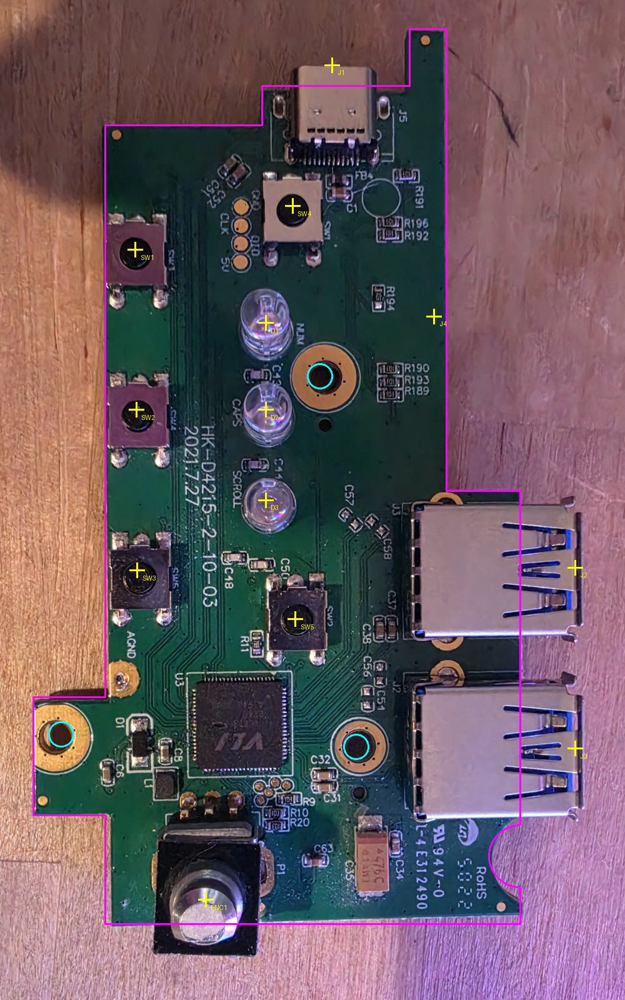

# Measurements

Every mechanical number the board depends on, where it came from, and how sure
we are. All positions are in mm from the **bottom-left corner of the main
body**, +Y up. The USB-C end is the top and the knob end is the bottom, with
the component side facing you and the USB-A ports pointing right.

The same numbers live in [`hardware/scripts/gen_board.py`](../hardware/scripts/gen_board.py).
Change them there and regenerate.

**Source key:**
- **measured**: caliper/ruler on the real board
- **photo**: traced from a top-down photo scaled so the main body is 83.9 mm; expect ±1–2 mm
- **datasheet**: from the part's datasheet

*Magenta: outline. Cyan: mounting holes. Yellow: part centres, as used by the generator.*

## Outline

| What | Value | Source |
|---|---|---|
| Main body length (bottom edge → main top edge) | 83.9 ± 0.5 | measured |
| USB-C tab top | 88.0 | measured |
| Thin finger top | 94.0 | measured |
| Finger width | ~4 | measured |
| Main body width (left edge → J4 edge) | 35.9 | photo, probably the "36 mm" on the sketch |
| Width at the USB-A section | 43.6 | photo |
| USB-A section starts at y | 45.5 | photo |
| USB-C tab left edge x | 16.5 | photo |
| Finger left edge x | 32.0 | photo |
| Left mounting tab: sticks out to x | −7.55 | photo |
| Left mounting tab: y from–to | 11.4 – 23.8 (12.4 tall) | photo, probably the "12 mm" on the sketch |
| Notch on USB-A edge: opening length × depth | 9.35 × 3.5 | measured |
| Notch upper end y (near USB-A #2) | 10.4 (lower end ≈ 1.05) | photo |

## Mounting holes (all photo, M2.5 assumed)

| Hole | x | y |
|---|---|---|
| H1 (between LEDs and J4) | 22.6 | 57.5 |
| H2 (near USB-A) | 26.4 | 18.6 |
| H3 (left tab) | −4.6 | 19.9 |

## Parts that must line up with the case

| Part | x | y | Notes |
|---|---|---|---|
| J1 USB-C, mouth edge | 23.9 | 90.2 | Mouth sticks out ~2 mm past the tab (photo) |
| J2 USB-A #1, mouth edge | 49.4 | 37.4 | ~5.8 mm past the board edge (photo) |
| J3 USB-A #2, mouth edge | 49.4 | 18.4 | 19 mm port pitch (photo) |
| J4 key-matrix flex pads (bottom side) | 33.1 – 35.6 | 51 – 76.5 | 26 pads, 1.0 mm pitch (26 mm measured); flex soldered on, overlapping from the board edge |
| ENC1 volume encoder shaft | 10.0 | 5.8 | From the fit-check print (50 mm bar for scale): the body sits about flush with the bottom edge. The first photo trace (2.5) measured the shaft *tip*, which parallax shifted ~3 mm outward. Caliper check welcome |
| SW1 / SW2 / SW3 (left column) | 3.2 / 3.3 / 3.4 | 70.8 / 54.0 / 37.1 | photo |
| SW4 (by USB-C) | 19.7 | 75.4 | photo |
| SW5 (middle) | 20.0 | 32.0 | photo |
| D1 NUM / D2 CAPS / D3 SCROLL | 16.9 | 63.1 / 54.0 / 44.5 | 5 mm LEDs, ~9 mm tall (measured) |

## Heights (measured)

| Part | Height |
|---|---|
| USB-A | ~7 mm |
| LEDs | ~9 mm |
| Encoder body | 6 mm (matches Bourns PEC12R: 6.0 mm) |
| Encoder shaft | "14 mm". **To confirm:** from the PCB or from the top of the body? |
| Encoder collar | 7 mm diameter (matches PEC12R: 7.0 mm) |

## Still to measure

1. **Encoder:** shaft length from the PCB surface. Clicks: 5 per quarter turn, so 20 per full turn (confirm by counting a full turn). No push switch.
2. **Mounting holes:** real diameters and caliper positions.
3. Anything above that's marked *photo* and has to fit the case exactly: the USB port positions and the outline steps.

## Checking the fit

Print [`fit-check-1to1.pdf`](fit-check-1to1.pdf) at **100% / "Actual size"**, not "fit to page".
Measure the 50 mm bar first. If it's off, the printer scaled the page and nothing else on it is trustworthy.
Then lay the original board on the print and mark where it disagrees.
